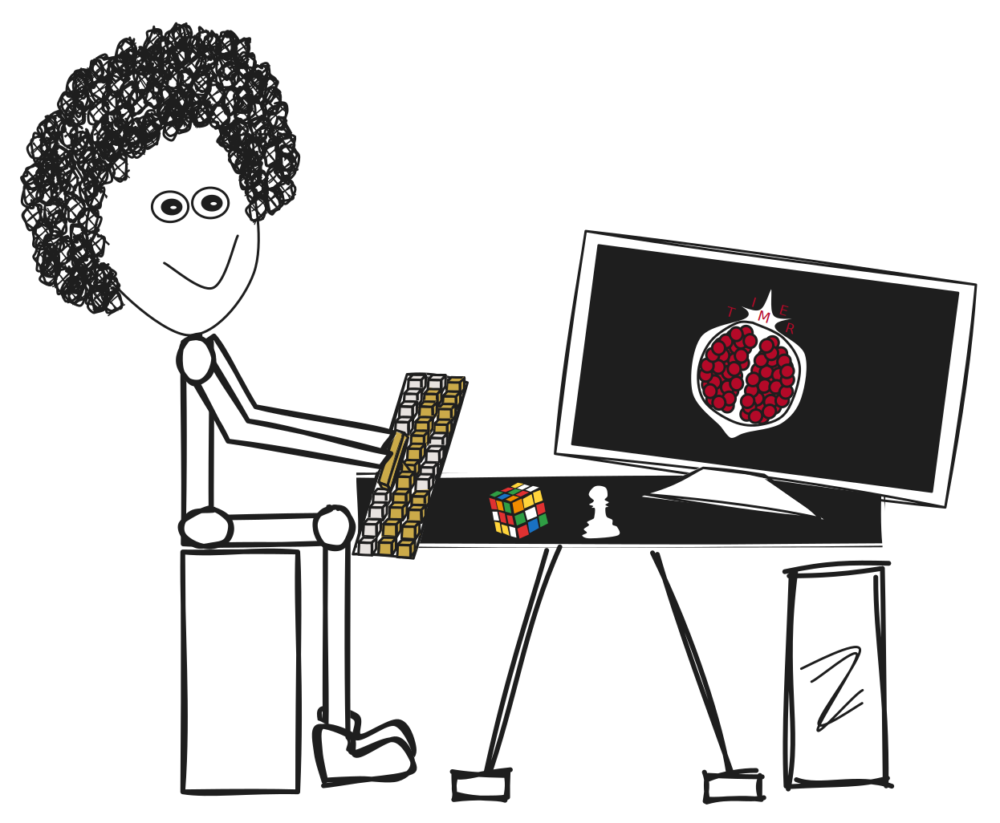

   
  <samp>POMEGRANATE TIMER</samp> 
  <samp>
    Your life is like a pomegranate; 
    every single granule you eat is never back again, 
    and unfortunately, you do not have unlimited granules. 
    So, exploit every single granule.
  </samp>

#### The Story Behind Pomegranate Timer

   

  <samp>
   Since Mr. Z suffers from procrastination, he decides to start developing the Pomegranate Timer. 
    This is a simple idea to track productivity without unnecessary complexity. 
    The next release will include more data about each session and will 
    analyze this data to provide simple insights into progress. 
  </samp>

#### Pomegranate Timer Concept
-  The concept is inspired by the analogy of a pomegranate representing life where each granule symbolizes time.
-  The timer encourages users to make the most out of their time, similar to consuming each granule of a pomegranate.

#### Functionalities
- Allows users to set a timer for a specified duration, tracking hours, minutes, and seconds.
- Prompts users for details such as their current activity, a motivational quote, and their mood.
- Then the timer starts counting down until the time is gone.
- Records session information including the date, start time, end time, total time, activity, motivation, and mood.
- Stores this information in a structured format (JSON) for later reference and analysis.
- See from [here]() the nitty-gritty details of what actually happens in the entire process and how to run the script.
#### Motivational Aspect
- Incorporates a motivational message at the beginning of each session to inspire users to utilize their time effectively.
#### Next release
- We'll incorporate additional data and develop a website or a similar platform, not just a script. This platform will utilize the gathered data from each session to generate insights and graphs for individual users.

> [!NOTE]
> At the end of the day, this is a simple tool that motivates me to work without any distractions, and I hope it inspires someone else.
