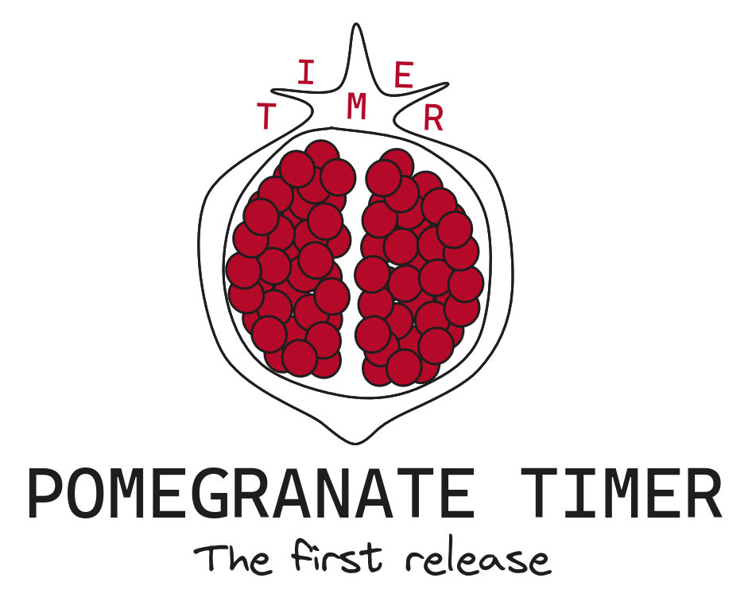

<p align="center">
 <br>
</p>

#### Getting Started
1. Download and Setup
   -  Ensure you have Bash installed on your system.
   -  Clone this repository into your preferred directory.
   -  Open a terminal window and navigate to the directory where the script is saved.
2. Running the Script
   - In the terminal, type ```./start.sh``` and hit Enter to execute the script.
   - Follow the on-screen instructions to set up your focus session.

#### Using the Pomegranate Timer
- Initializing
   - The script will initialize your session by creating a directory for the current year and a JSON file for the current date if they don't already exist.
- Starting a Focus Session
   - After initialization, the script will prompt you to set the duration of your focus session in hours, minutes, and seconds.
   - You will also be asked to provide information about your current activity, a motivational quote, and your mood.
   - Once set, the focus session will begin, and a timer will countdown your session time.
- During the Session
   - While the timer is running, a fun pomegranate art will be displayed on the screen.
   - You can monitor the time remaining for your session.
- Session End
   - When the session ends, an alarm will sound.
   - Your session information, including start time, end time, total time, activity, motivation, and mood, will be saved in the JSON file.
- Exiting the Script
   - After the session ends, the terminal screen will be cleared.

>[!NOTE]
> Archiving the data about each session will be added soon.
